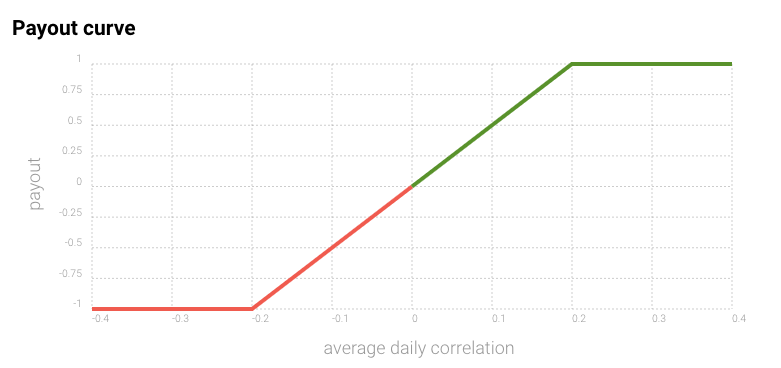

# Visión General del Torneo

## Introducción <a id="rounds"></a>

Numerai es un torneo de ciencia de datos \(data science\) que alimenta al hedge fund Numerai. Mira el [video del meta-modelo](https://www.youtube.com/watch?v=dhJnt0N497c) para entender a alto nivel como funciona. 

La visión a largo plazo de numerai consiste en manejar todo el dinero del mundo con una red descentralizada de agentes autónomos de IA \(inteligencia artificial\). Lee nuestro [plan maestro](https://medium.com/numerai/numerais-master-plan-1a00f133dba9) para saber más.

Este documento es una breve descripción de la estructura y reglas del torneo. Si eres nuevo, comienza por aquí!

## Datos <a id="rounds"></a>

Para hacer buenas predicciones, necesitas buenos datos. Pero encontrar datos financieros de alta calidad no es nada sencillo. Los hedge funds gastan millones comprando y manejando estos datos, así que los mantienen en secreto.

Numerai proporciona estos datos de alta calidad de manera gratuita. Nuestros datos están [ofuscados](https://medium.com/numerai/encrypted-data-for-efficient-markets-fffbe9743ba8) para mantener los instrumentos y caracterísitcas en secreto a la vez que se conserva la estructura subyacente de los datos.

Esta es la pinta de nuestro conjunto de `training_data`. Cada `id` representa un instrumento con algunas`features` abstractas, y cada `era` es un periodo de tiempo en la historia. El `target` es una medida abstracta de rendimiento..



## Modelado <a id="rounds"></a>

Tu tarea es entrenar un modelo para hacer predicciones sobre los datos fuera-de-muestra`tournament_data`. Este conjunto de datos incluye conjuntos `validation` y `test` , así como `live` features del mercado actual.

Aquí hay un ejemplo básico de modelado.

```python
import pandas as pd
from xgboost import XGBRegressor

# training data contains features and targets
training_data = pd.read_csv("numerai_training_data.csv").set_index("id")

# tournament data contains features only
tournament_data = pd.read_csv("numerai_tournament_data.csv").set_index("id")
feature_names = [f for f in training_data.columns if "feature" in f]

# train a model to make predictions on tournament data
model = XGBRegressor(max_depth=5, learning_rate=0.01, \
                     n_estimators=2000, colsample_bytree=0.1)
model.fit(training_data[feature_names], training_data["target"])

# submit predictions to numer.ai
predictions = model.predict(tournament_data[feature_names])
predictions.to_csv("predictions.csv")
```

Para ayudarte a empezar, también hemos creado dos guías detalladas del problema en [Python](https://github.com/numerai/example-scripts/blob/master/analysis_and_tips.ipynb) y [R](https://github.com/numerai/example-scripts/blob/master/example_model.r). Estas guías abordan conceptos clave como la importancia de las características, validación cruzada, consistencia, sobreajuste, y el uso de las `eras`. Seas un novato o un masetro en la ciencia de datos, te recomendamos encarecidamente que visites estas guías!

Si quieres saber más sobre las razones para diseñar el problema de esta manera, consulta el libro [Advances in Financial Machine Learning](https://www.amazon.com/Advances-Financial-Machine-Learning-Marcos/dp/1119482089) de [Marcos Lopez de Prado](https://www.linkedin.com/in/lopezdeprado/), que es nuestro consejero científico.

## Envíos

Cada fin de semana, una nueva ronda comienza con la publicación de nuevos `tournament_data`. Para participar en la ronda, pasa los nuevos `tournament_data` por tu modelo, y envía tus predicciones de vuelta a Numerai.

Los ficheros a enviar tienen esta pinta. La columna `id` ha de coincidir de manera exacta con la de `tournament_data`. La `prediction` puede ser culaquier número entre 0 y 1 \(exclusivo\).


Puedes enviar tus predicciones en cualquier momento antes del comienzo de la siguiente ronda. Sin embargo, sólo los envíos previos al `Lunes 14:30 UTC` se consideran a-tiempo. Los envíos posteriores no se tienen en cuenta para calcular tu puntuación y no son elegibles para pagos o bonuses.


Puedes enviar tus predicciones a traves de nuestra [website](https://numer.ai/) o[ api](https://api-tournament.numer.ai). Tambien puedes utilizar las librerias cliente de [Python](https://github.com/uuazed/numerapi) y [R](https://github.com/Omni-Analytics-Group/Rnumerai) para programar los envíos.

Para usuarios avanzados, consulta [Numerai Compute](https://docs.numer.ai/tournament/compute) - un entorno para ayudarte a automatizar todo tu trabajo hasta el envío. 

## Puntuación

Numerai mide el rendimiento en base a la `rank_correlation` entre tus predicciones y los targets verdaderos



```python
# method='first' breaks ties based on order in array
ranked_predictions = predictions.rank(pct=True, method="first")
correlation = np.corrcoef(labels, ranked_predictions)[0, 1]
```



Cada día \(durante 4 semanas\) el envío recibe un valor de correlación actualizado indicando lo bien que lo ha hecho hasta el momento.

Si envias nuevas predicciones cada semana, tendrás puntuaciones de varios envíos solapadas tal como se muestra más abajo. Ten en cuenta que no hay puntuaciones los domingos y lunes. Estos huecos corresponden a los fines de semana, en los que los mercados están cerrados.


Aquí se ve el rendimiento del modelo de ejemplo durante 10 semanas. Cada linea en color representa la correlación de un envío diferente. Ten en cuenta como se intercalan.


Nosotros combinamos estas puntuaciones solapadas en una sóla puntuación tomando el cambio diario marginal en `correlation` de cada envío, y promediando sobre todos los envíos solapados. A esto le llamamos `average_daily_correlation`, y es la puntuación principal en la que se basan todos los pagos y bonuses.

Aquí hay un gráfico de los cambios diarios marginales en`correlation` mostrados en color y punteados, y el `average_daily_correlation` en negro sólido


## _Staking_ <a id="staking"></a>

Puedes hacer un `stake` en tu modelo para empezar a recibir pagos diarios.

Hacer _staking_ requiere que bloquees [NMR](https://coinmarketcap.com/currencies/numeraire/) en un contrato de [Erasure](https://github.com/erasureprotocol/erasure-protocol). Esto da a Numerai la capacidad de destruir \(quemar o griefing\) tus NMR si tu rendimiento es pobre. A esto se le conoce como tener "skin in the game"


Tus pagos diarios son una función de tu `stake_value` y tu `average_daily_correlation`. Por ejemplo, si tu `stake_value` es 100 NMR, y tu `average_daily_correlation` es 0.1, tu pago será +50% y por lo tanto ganarás 50 NMR. Si por el contrario tu `average_daily_correlation` es -0.1, entonces tu ganancia sera -50% por lo que perderás 50 NMR.

Los pagos ocurren cada día que se actualizan las puntuaciones, y la curva de pago se aplica a cada puntuación`average_daily_correlation` independientemente. Todos los pagos se acumulan en tu balance de _stake_, pero no afectan a tu `stake_value` usado para el cálculo de pagos hasta el siguiente jueves. Por ejemplo, los pagos calculados desde el día 11 al 17 usan el valor inicial de `stake_value` de `100` pero a partir del 18, los pagos usarán `150` como `stake_value`.


Puedes crear y manejar tu _stake_ a través de la [website](http://numer.ai) o directamente [en la cadena de bloques Ethereum](https://github.com/numerai/tournament-contracts). A continuación hay un ejemplo de _staking_ en la web.


Puedes incrementar tu _stake_ en cualquier momento y entrará en efecto el siguiente jueves. Disminuir funciona de manera similar, con la excepción de que requiere 4 semanas adicionales.

Al comienzo de cada jueves, hasta `100K NMR` de _stakes_ serán seleccionados y elegidos para el pago. Si la cantidad total excede esta cifra, todas las _stakes_ serán seleccionadas pro rata.

Si todavía no tienes NMR, puedes adquirirlos en el mercado. La forma más sencilla es a través de [ETH](https://coinmarketcap.com/currencies/ethereum/) en [Uniswap](https://uniswap.exchange/swap) o mediante [BTC](https://coinmarketcap.com/currencies/bitcoin/) en [Changelly](https://changelly.com/), [Upbit](https://upbit.com/exchange?code=CRIX.UPBIT.BTC-NMR), [Bittrex](https://bittrex.com/Market/Index?MarketName=BTC-NMR), [Poloniex](https://poloniex.com/exchange#btc_nmr), y [HitBTC](https://hitbtc.com/NMR-to-BTC).

## Leaderboard

Mantener una alta `average_daily_correlation` a lo largo del tiempo te proporcionará un buen lugar en el leaderboard y un gran bonus diario.


Tu posición `(rank)` en el leaderboard depende de tu reputación `reputation`, que es la suma de tus  `average_daily_correlation` durante los últimos 100 días.

Cualquier día sin un valor de `average_daily_correlation` se rellenará con `-0.005`. Llamamos a esta puntuación ajustada `average_daily_correlation_penalized` y la utilizaremos para calcular tu reputación. Esto signnifica que los nuevos usuarios comienzan con `reputation` de `-0.5`. Esto también quiere decir que, si has estado enviando predicciones semanalmente, necesitas saltarte 4 semanas seguidas para ser penalizado.

Tu bonus es una función de tu `rank` entre todos los modelos con _stakes_ \(`staked_rank`\) y tu `stake_value` al comienzo de la ventana de 100 días. Por ejemplo, si tu `stake_value` era 100 NMR al comienzo de la ventana y tu `staked_rank` es 1, recibirás un bonus de 5 NMR. 

Como los pagos, los bonus se añaden a tu balance de _stake_. El máximo bonus pagado por día es `250 NMR` entre todos los modelos. Si la cantidad de bonus total es superior, entonces todos los bonuses se pagan pro rata.

| Staked Rank | Daily Bonus |
| :--- | :--- |
| Top 1 | 5% |
| Top 10 | 4% |
| Top 25 | 3% |
| Top 100 | 2% |
| Top 300 | 0.5% |

Nos reservamos el derecho de devolver tu _stakes_ e invalidar todos las ganancias y pérdidas si creemos que estas abusando activamente o explotando las reglas de pago.

## Soporte 

¿Necesitas ayuda con algo?

Encuentranos en [rocket chat](https://community.numer.ai) para preguntas, soporte y feedback!

